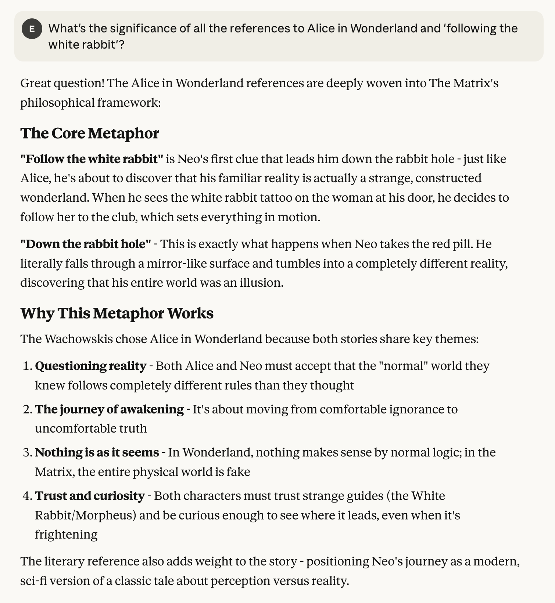
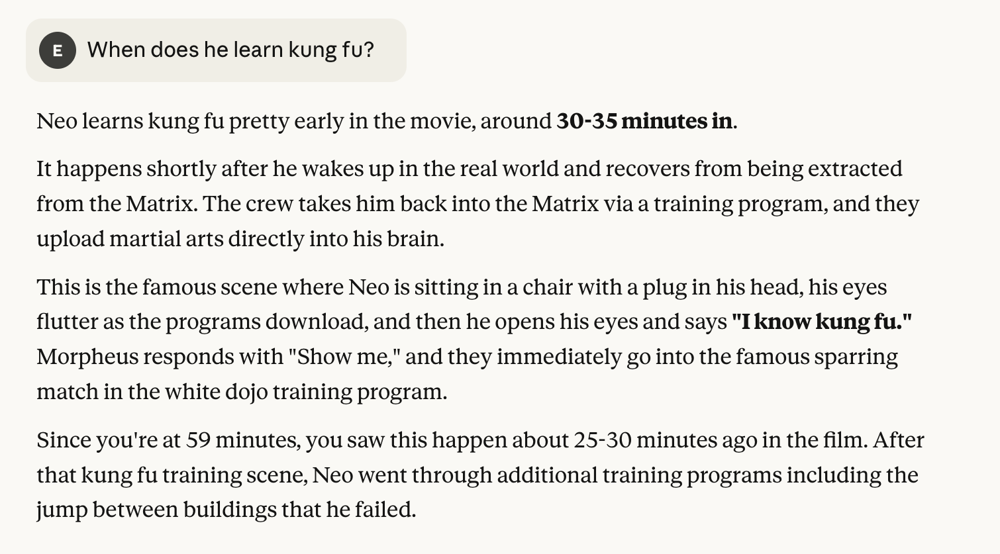
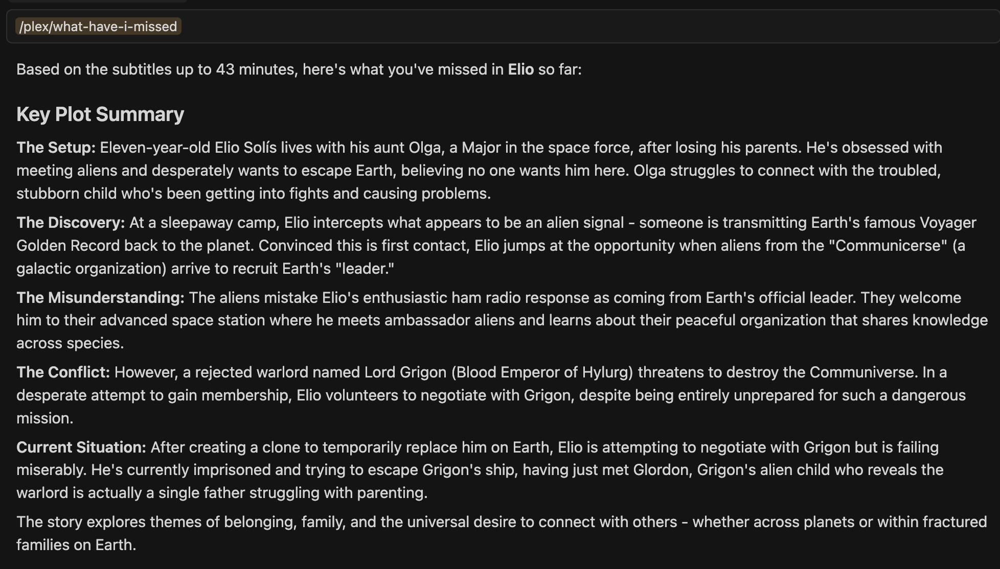

# Plex MCP Server

A Model Context Protocol (MCP) server that bridges your Plex Media Server with AI assistants, enabling real-time contextual insights about your viewing experience.

## Motivation

I wanted to experiment with MCP and thought it would be interesting to integrate my Plex movie-watching experience with an LLM.
As someone who enjoys deep-diving into films, I often find myself wanting to understand plot points I may have missed or explore deeper context while watching.
This project provides real-time context of my current viewing experience through subtitle analysis, allowing me to:

- **Recap movies** to the current playback position when I join mid-way
- **Ask questions** about plot developments, characters, and themes
- **Deep-dive further** into cinematic elements while actively watching
- **Get contextual summaries** based on what has actually happened on screen

By leveraging OpenSubtitles for real-time subtitle context, the LLM can understand exactly where I am in a film and provide relevant, spoiler-aware responses.

 

 

## Architecture

This server is built with **Laravel 12** and **Laravel MCP**, exposing functionality through both:

- **Streamable HTTP** - For web-based MCP clients
- **Stdio** - For local MCP client integration

### MCP Tools

#### 1. Get Active Sessions

Monitors current playback sessions on your Plex server, including:

- User details and device information
- Playback progress and timestamps
- Transcoding status
- Media quality metrics

#### 2. Search Subtitles

Searches and retrieves subtitles from OpenSubtitles by:

- IMDb ID or title search
- Language filtering
- Optional time-based filtering (returns subtitles up to a specific minute)

### MCP Prompts

#### What Have I Missed

An intelligent prompt that:

1. Detects your currently playing content
2. Retrieves subtitles up to your current playback position
3. Generates a concise, chronological summary of key plot points
4. Provides context-aware insights without spoilers

## Features

- **Real-time Session Monitoring** - Track active playback across all devices
- **Subtitle-based Context** - Leverage OpenSubtitles for accurate content understanding
- **Intelligent Summaries** - AI-generated recaps based on actual dialogue and events
- **Spoiler-safe** - Only provides information up to your current viewing position
- **Multi-client Support** - Works with any MCP-compatible client (Claude Desktop, Cursor, etc.)

## Prerequisites

- Docker & Docker Compose
- Plex Media Server with authentication token
- OpenSubtitles API credentials

## MCP Client Configuration

### HTTP Streaming

Add to your MCP client configuration:

```json
{
  "mcpServers": {
    "plex": {
      "type": "http",
      "url": "http://localhost:8001/mcp/plex"
    }
  }
}
```

### Stdio

```json
{
  "mcpServers": {
    "plex": {
      "command": "make",
      "args": ["mcp/plex"]
    }
  }
}
```

## Usage

### Example Workflows

**1. Catch up on a movie you joined late:**

```
User: What have I missed in the movie?
Assistant: [Uses "What Have I Missed" prompt with subtitle context]
```

**2. Deep-dive during viewing:**

```
User: What's the significance of all the references to Alice in Wonderland and 'following the white rabbit'?
Assistant: [Uses subtitle search to understand context and provide spoiler-free analysis]
```

```
User: When does he learn kung fu?
Assistant: [Uses subtitle search to understand context and provide spoiler-free analysis]
```

**3. Monitor your viewing sessions:**

```
User: What am I currently watching?
Assistant: [Uses Get Active Sessions tool to show playback details]
```
